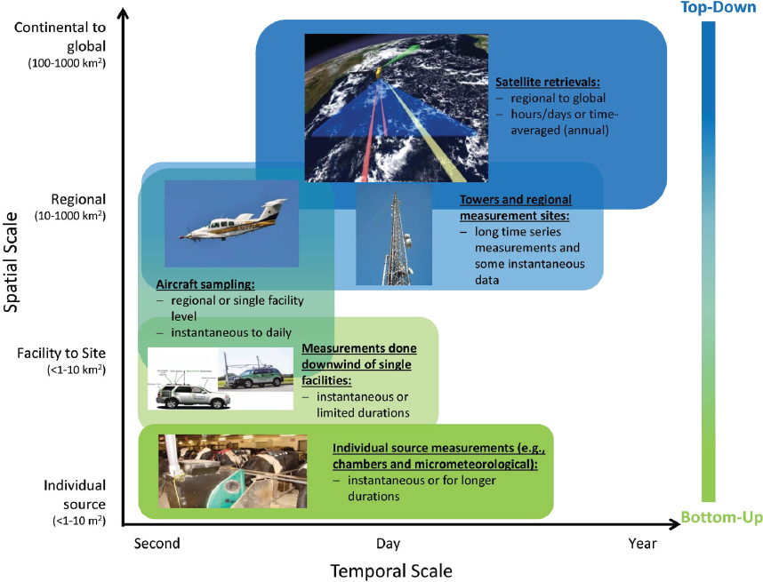

== Scope
Methane (CH4) is one of the most potent greenhouse gases, and the comparative impact of methane is 25 times greater than CO2 over a 100-year period [http://www.ipcc.ch/report/ar4/[IPCC 2007]].
Methane is an invisible and odourless gas, and it is very labour intensive and time consuming in order to detect and repair leaks.
Current methane emission management solutions are fragmented and developed without standards, ultimately leading to a complex network of incompatible sensing solutions that need to interrelate but are impossible. However, no single methane sensing technology can meet the accuracy, spatio-temporal resolution, and low-cost requirements. There is a need to interconnect the heterogeneous existing and emerging methane sensing technologies, ranging from satellites, drones, fixed-wing fly-overs, vehicle-based systems, and continuous in-situ monitoring stations to handheld Optical Gas Imaging (OGI) devices. An effective methane emissions management solution requires an integrated methane sensor web. https://www.ogc.org/standards/swes[OGC Sensor Web Enablement (SWE)] provides the fundamental standard building blocks for the integrated methane sensor web.

[[fig-methane-sensor-data-examples]]
[.text-center, width="90%"]
.Examples of methane measurement platforms operating across a variety of spatial and temporal scales. (https://www.nap.edu/read/24987/chapter/1[National Academies of Sciences, Engineering, and Medicine. 2018])

This OGC Best Practice (OGC BP) defines a SensorThings API for fugitive methane emissions management. Regulations play a critical role in methane emissions reduction, and how methane emissions are detected, repaired, and managed is highly dependent on local regulations.
This OGC BP is designed based on the Alberta Energy Regulator's regulatory requirement for fugitive emissions management [https://static.aer.ca/prd/documents/directives/Directive060.pdf[AER Directive 60]].

This OGC BP document provides a data model and API for the exchange of fugitive emissions observation data and the necessary metadata, both within and between different organizations.  For example, it can be used for leak detection and repair service providers to prepare and exchange fugitive emissions observation data with the facility operators. Facility operators can also use the OGC BP to exchange fugitive emissions data within the organization and with regulators.

Venting and combustion methane emissions are out of scope in this BP. The development of BP for venting emissions and combustion emissions are on the roadmap.

=== Roadmap

This OGC BP is the first part of the OGC Integrated Methane Sensor Web for Emissions Management BPs. We plan to publish a series of OGC BPs for methane emissions management, ranging from data sources (e.g., different types of sensing systems) to data destinations (e.g., fugitive and venting emissions for regulatory reporting). The goal is to develop the building blocks for an integrated Methane Emissions Sensor Web, enabling seamless flows of observation data between various nodes: from SensorThings nodes with heterogeneous sensing sources (i.e., multiple disparate methane observation systems), to SensorThings nodes with analytics-ready data (i.e., an aggregated methane emissions datalake), and eventually to SensorThings nodes with compliance-ready data (i.e., data compliant to various regulatory organizations in different jurisdictions).

The figure below shows the roadmap of the different OGC BPs to be developed and their relationship.

[[fig-methane-emisssions-bp-roadmap]]
[.text-center, width="100%"]
.Methane emissions sensor web best practice roadmap
image::figures/FIGn.002.png[Methane Emissions Sensor Web Roadmap]

=== Design Goals

OGC BP and its series have the following design goals:

. Modular: different parts of a methane emissions management system can be separated and reassembled, benefiting flexibility, future-proof, and variety in use;
. Simple: the design is concise, easily testable, easy to implement, and developer-friendly;
. Interoperable: whenever possible, it follows international open standards;
. Scalable: it is able to grow in terms of the number of sensors, types of sensors, and volume of data without sacrificing performance.
