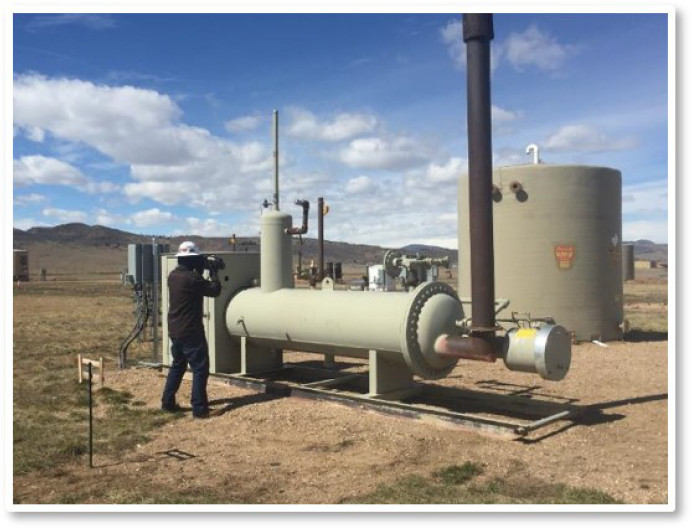
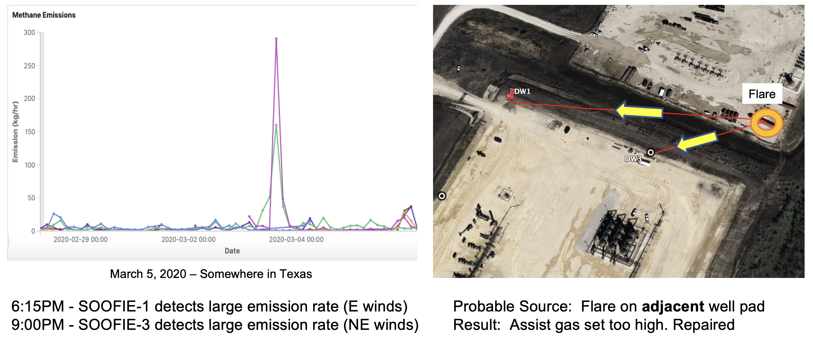
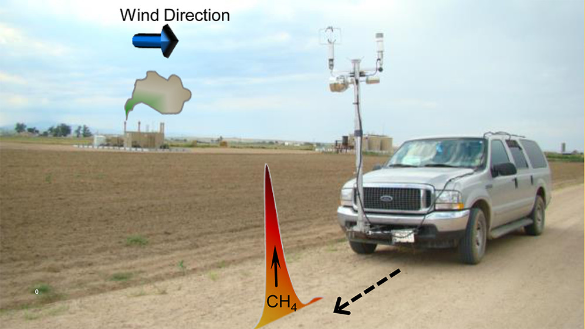
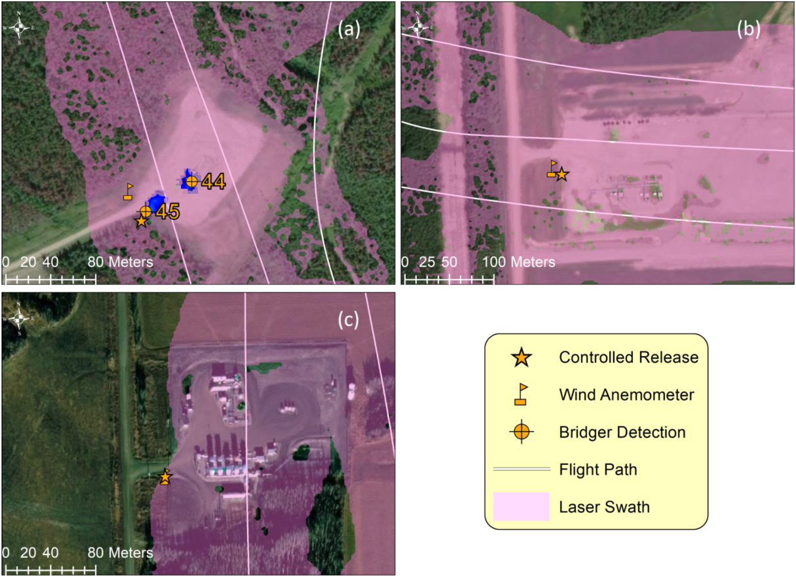
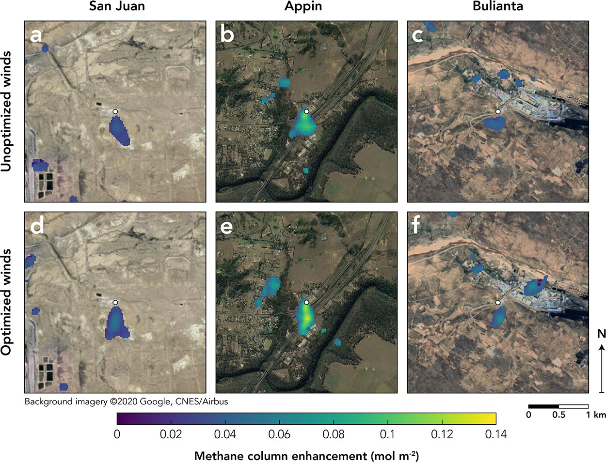

== Methane Emissions

In the Fifth Assessment Report (AR5)[3], the IPCC estimates the GWP of methane to be 84 times over a period of 20 years and 28 times over a period of 100 years. Therefore, 1 tonne of emitted methane can be considered equivalent to 28 tonnes of emitted CO2 when looking at its warming impact over 100 years. The current atmospheric concentrations of CO2 and methane are about 400 ppm and 2 ppm, respectively. Thus, the concentration of methane is 200 times lower than that of CO2[4]. However, this small fraction of methane has a considerable warming potential which is equivalent to 2 × 28 = 56 ppm of CO2 over 100 years and 2 × 84 = 168 ppm of CO2 over 20 years. Therefore, even though methane is 200 times less concentrated than CO2, its warming potential is only about seven times lower than that of CO2 over a period of 100 years, and about 40 % of the CO2 warming potential over a period of 20 years. In another word, although methane's lifetime in the atmosphere is much shorter than CO2, methane is more efficient at trapping heat than CO2. Because methane is so potent, and because we have solutions to reduce its emissions, addressing methane is the fastest, most effective way to slow the rate of warming. Methane is produced by the breakdown of buried organic materials due to heat and pressure in the earth or by the decomposition of organic matter. Methane can be introduced into the atmosphere by either natural processes or human activities. Natural processes consist of the decay of plant material in wetlands, the leakage of gas from underground deposits, while human activates source of emissions embrace oil and gas industry, agriculture, and waste management. Wetlands including ponds, lakes, and rivers are responsible for about 30% of methane emissions to the atmosphere. Another 20% is produced by agriculture, due to a combination of livestock, waste management, and rice cultivation. Activities related to oil and gas production and coal extraction release an additional 30%. The remainder of methane emissions come from minor sources such as wildfire, biomass burning, permafrost, termites, dams, and the ocean. In Canada, Oil and Gas facilities are the largest industrial emitters of methane. They release 44% of total methane emissions. Upstream activities such as exploration, drilling, production, and field processing contribute close to 90% of methane emissions and account for 26% of Canada’s total GHG emissions [5]. The Government of Canada has developed methane emissions regulatory frameworks to be applied in a target of achieving a 40 to 45% reduction in methane emissions from the upstream oil and gas industry by 2025. In the Oil and Gas Industry, methane emissions to the atmosphere are often organized as either vent gas or fugitive emissions. Vent gas emissions are intentional releases of methane, typically in a controlled manner, resulting from normal process conditions. On the other hand, fugitive emissions which also called 'leaks' are unintentional releases of methane from sources that should not be emitting such as broken valves or flanges.

== Methane Emissions Sensing Technologies

Methane emissions sensing technologies can be categorized by the methane sensor types or by the methane sensing platforms. Based on its sensing priciples, methane emssions sensors can be categorized into the following types: (1) optical sensors, (2) calorimetric sensors, (3) pyroelectric sensors, (4) semiconducting metal oxide sensors, and (5) electrochemical sensors. The following table summarize their advantages and disvantages. Aldhafeeri et al provides a comprehensive review of methane gas detection sensors, including the recent development and future perspectives [https://www.mdpi.com/2411-5134/5/3/28/htm[Aldhafeeri 2020]].

Methane concentration measurements are mostly made with optical instruments, using either laser spectroscopy or imaging spectrometry [6]. Laser spectroscopy determines the concentration of target molecules by measuring the characteristic absorption of a mid- or near-infrared laser along a path length of meters to kilometers. Unlike laser-based instruments, imaging spectrometers measure spectral densities using pixel-based sensor elements. Imaging spectrometers generate a multi-pixel field of view measurement that captures column-integrated concentrations. Other sensor classes exist, such as ionization devices and differential absorption light detection and ranging [5]. These sensor classes are used different types of platforms. Five general platforms for detecting and screening fugitive emissions are handheld instruments, fixed sensors, a vehicle with mounted sensors, aerial vehicles, and satellites. In the following, we are going to introduce each platform.

=== Handheld Instruments

For many years the standard leak detection practice has been https://www.epa.gov/emc/method-21-volatile-organic-compound-leaks[EPA method 21: Determination of Volatile Organic Carbon Leaks]. EPA method 21 requires that components be surveyed using a method 21 compliant portable instrument that can measure the volatile organic carbon (VOC) concentration near each component with sufficient accuracy. Method 21 is still favored by some operators, but the use is declining as Gas-imaging cameras are more convenient. Gas-imaging cameras often referred to as optical gas-imaging (OGI) cameras, are a tool for detecting fugitive emission sources. These cameras provide images and video recordings of leaks that are invisible to the human eye. In recent years, OGI cameras have become the standard for Leak Detection and Repair (LDAR) because they generate easily communicable and intuitive results for reporting purposes, and are more efficient than Method 21, as they survey components remotely.

[[fig-ogi-flir-data]]
[.text-center, width="60%"]
.A field technican performs methane emission survey with an optical gas imaging camera [https://pubs.acs.org/doi/full/10.1021/acs.est.0c01285[Zimmerle et al., 2020]]

===	Fixed Sensors

Fixed sensors are deployed in high-risk areas and provide continuous readings of methane concentration. Optical methods are most common, including laser-based line-integration sensors, fixed concentration detectors, and camera installations. Continuous monitoring and the potential for automation make fixed sensors appealing, especially in dense infrastructure. As a screening tool, a distributed sensor network could identify fugitive emissions nearly instantaneously, preventing extended emissions events that remain undetected between mobile screening and conventional LDAR visits. As the only non-mobile technology class, fixed sensors might be best suited for facilities with high component density (e.g., gas plants, compressor stations, multi-well pads).

[[fig-soofie-data]]
[.text-center, width="90%"]
.Example data of SOOFIE

===	Vehicle With Mounted Sensor

Vehicles equipped with methane sensors and anemometers to account for atmospheric conditions can be used to detect methane emissions over a large area in a short amount of time. Data are tracked by location using a GPS, and methane concentrations and fluctuation rates can be calculated. This setup enables a survey approach called concentration mapping, which generates a map of methane concentrations along the vehicle path. Road accessibility can limit the use of these vehicles, and their sensors cannot differentiate between fugitive emissions and vent gas emissions.

[[fig-mobile-ground-lab]]
[.text-center, width="90%"]
.A methane measurement mobile ground lab system [https://pubs.acs.org/doi/full/10.1021/es503070q[Brantley, et al. 2014]]

===	Aerial Vehicle

Aerial vehicles, such as piloted aircraft or unmanned aerial vehicles, mounted with a methane detection sensor can also be used to detect emissions over large areas in a short amount of time. Aerial vehicles may not be able to differentiate between fugitive emissions and vent gas emissions or be able to isolate the source of emission.

[[fig-bridger-data]]
[.text-center, width="90%"]
.Example data of Bridger Photonics [https://www.sciencedirect.com/science/article/pii/S003442572100136X[Johnson, et al. 2021]]

===	Satellites

Satellites that use optical imaging technologies, such as thermal and short-wave infrared sensors, can be used to detect emissions over large areas. Satellites provide low-resolution imagery, so they cannot be used to identify the source of the emission or low-level emissions, but because they can collect data frequently (daily or weekly), they can be used to identify abnormal or stochastic emission sources. These technologies encompass broad spatial and temporal scales of measurement. Therefore, different technologies and methods are suitable for different monitoring programs, and different data products can be expected. In Alberta, regulations released in December 2018 mandate screening for fugitive emissions using one of several methods. The next section of this discussion paper will use Directive 60 in Alberta, as an example of a methane fugitive emissions leak detection and repair program.

[[fig-ghgsat-data]]
[.text-center, width="90%"]
.Example data of GHGSat [https://pubs.acs.org/doi/full/10.1021/acs.est.0c01213[Varon et al., 2020]]

=== Clauses not containing normative material sub-clause 2
