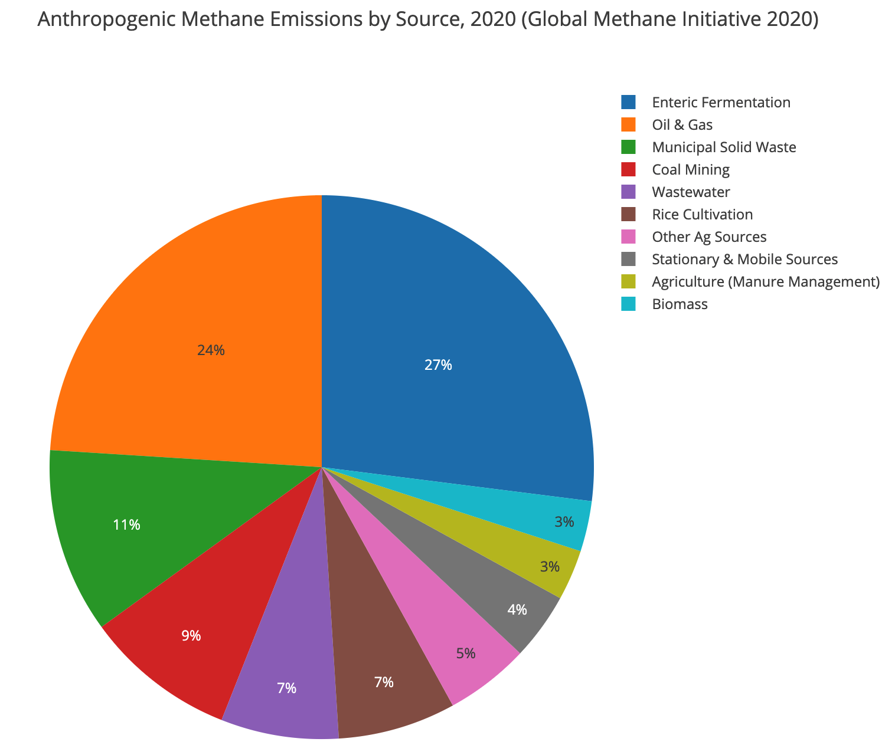

== Methane Emissions

Methane (CH4) is one of the most potent greenhouse gases, and the comparative impact of methane is 25 times greater than CO2 over a 100-year period http://www.ipcc.ch/report/ar4/[[IPCC 2007]]. Global anthropogenic methane emissions by 2020 are estimated to be 9,390 million metric tons of CO2 equivalent [https://www.globalmethane.org/documents/gmi-mitigation-factsheet.pdf[Global Methane Initiative 2020]]. Approximately 50~60% of the anthropogenic methane emissions come from the following five sources: (1) agriculture (enteric fermentation-27% and manure management-3%), (2) oil and gas (24%), (3) municipal solid waste (11%), (4) coal mining (9%), and (5) wastewater (7%). Figure below shows a pie chart of the global estimated methane emissions sources in 2020.

[[fig-methane-sources]]
[.text-center, width="80%"]
.Anthropogenic methane emissions by source 2020 [https://www.globalmethane.org/documents/gmi-mitigation-factsheet.pdf[Gobal Methane Initiative 2020]]

In the oil and gas industry vent gas and fugitive emissions are the two major sources of methane emissions. Vent gas is un-combusted gas, that is released into the atmosphere. Fugitive emissions are the unintentional releases of hydrocarbons into the atmosphere. This BP focuses on the detection and quantification of fugitive methane emissions in the oil and gas industry.

Methane is an invisible and odourless gas, as a result it is very labour intensive and time consuming in order to detect and repair the leaks. Current methane emissions management solutions are fragmented and being developed without standards, ultimately leading to a complex network of incompatible sensing solutions that need to interrelate but are not possible. However there is no single methane sensing technology that can meet the accuracy, spatio-temporal resolution, and low-cost requirements. There is a need to interconnect the heterogeneous existing and emerging methane sensing technologies, ranging from satellites, drones, fixed-wing fly-overs, vehicle-based systems, continuous in-situ monitoring stations, to handheld Optical Gas Imaging (OGI) devices. An effective methane emissions management solution needs an integrated methane sensor web. OGC Sensor Web Enablement (SWE) provides the fundamental standard building blocks for the integrated methane sensor web.

=== Methane Emissions Sensing Technologies

Methane emissions sensing technologies can be categorized by the methane sensor types or by the methane sensing platforms. Based on its sensing principles, methane sensors can be categorized into the following types: (1) optical sensors, (2) calorimetric sensors, (3) pyroelectric sensors, (4) semiconducting metal oxide sensors, and (5) electrochemical sensors. Readers interested in the details of different methane sensing principles can refer to [https://www.mdpi.com/2411-5134/5/3/28/htm[Aldhafeeri 2020]], and it provides a comprehensive review of methane gas detection sensors, including the recent development and future perspectives. For the leak detection and repair applications, optical sensors, either laser spectroscopy or imaging spectrometry, are the most common sensor type being used. The following table summarize their advantages and disadvantages.

[#table_req0,reftext='{table-caption} {counter:table-num}']
.Methane sensor types, their advantages and disadvantages adapted from [https://www.mdpi.com/2411-5134/5/3/28/htm[Aldhafeeri 2020]] - Table 1
[width="90%",options="header"]
|===
|Methane Sensor Types |Advantages |Disadvantages
|Optical sensors |Non-destructive; immune to electromagnetic interference; operate without oxygen |Expensive; high power consumption; lack of significance and distinctiveness of methane optical absorption region
|Calorimetric sensors |Low cost; simple; portable; easy to manufacture; good selectivity for methane; can operate in harsh environmental conditions |Low detection accuracy; susceptible to cracking, catalyst poisoning and oversaturation; high power consumption; short lifespan; require high temperature
|Pyroelectric sensors |Non-destructive; operate without oxygen; good sensitivity and responsivity; wide measuring range; operate at room temperature |High cost; high power consumption; immobile; difficult to manufacture
|Semiconducting metal oxide sensors |Low cost; lightweight and robust; long lifespan; resistant to poisoning |Poor selectivity; small and high operational temperature range; slow recovery rate; significant addictive dependency; affected by temperature; susceptible to degradation; sensitive to changes in humidity
|Electrochemical sensors |Three different sub-types: AE, IL, and SE. AE-based: low cost. IL-based: non-hazardous materials; high boiling points and low volatility; good selectivity for methane; can detect small leaks. SE-based: no leakage; safe; robust; good selectivity for methane; can detect small leaks |AE-based: susceptible to leakage and evaporation; hazardous materials; slow response time. IL-based: susceptible to leakage; slow response time. SE-based: require high temperature; unable to detect low gas concentrations; susceptible to degradation or loss of electrolyte.
|===

In terms of the methane sensing platforms, it can be categorized into the following types: (1) handheld instruments, (2) stationary in-situ or remote sensing sensors, (3) terrestrial mobile methane mapping systems , (4) airborne remote sensing systems, and (5) spaceborne remote sensing satellites. The following sections briefly introduce each methane sensing platform.

==== Handheld Instruments

For many years the standard leak detection practice has been https://www.epa.gov/emc/method-21-volatile-organic-compound-leaks[EPA method 21: Determination of Volatile Organic Carbon Leaks]. EPA method 21 requires that components be surveyed using a method 21 compliant portable instrument that can measure the volatile organic carbon (VOC) concentration near each component with high accuracy. However, method 21 is the most labor intensive and time consuming method. For example, it may take four to eight hours to complete surveying the components of a well pad. As a result, there are multiple attempts to develop new sensing technologies/platforms to replace method 21. Optical gas-imaging (OGI) cameras is the other type of handheld instrument, and it has been approved by many regulatory bodies. OGI cameras are a close-range remote sensing cameras that provide images and videos of methane leaks that are invisible to the human eye. It is intuitive to communicate and easy to document and report. OGI cameras are also twice more efficient than method 21. It is worth to note that method 21 and OGI cameras are the only methods that are able to accurately locate methane leaks at the component level. Locating leaking components are critical because the leaks can only be stopped by either repairing or replacing the components.

[[fig-ogi-flir-data]]
[.text-center, width="60%"]
.A field technician performs methane emission survey with an optical gas imaging camera [https://pubs.acs.org/doi/full/10.1021/acs.est.0c01285[Zimmerle et al., 2020]]

====	Stationary methane sensing systems

Stationary sensors are deployed near the potential methane emissions sources, and provide continuous methane concentration observations. Based on the sensor type, it can be further categorized into close-range remote sensing systems and in-situ sensing systems. Example of close-range methane remote sensing systems include Rebellion Photonics (acquired by Honeywell), Kuva systems, etc. Examples of in-situ methane sensing systems include Aeris Sensors, Project Canary, Eco-esolutions, Quanta3, Scientific Aviation, Teledyne, Troposphere and more. Low-cost in-situ methane sensor networks has a potential to be the future of methane leak detection technology, because it can potentially operate at a cost comparable to or even lower than currently periodic, manual inspections that tyically using the handheld instruments described in the section above. However, peer-reviewed researches and validations of the existing commercial systems are currently missing. There are multiple research projects, such as UT Astin's Project Astra or University of Calgary's Emissions Testing Centre, focusing on validating the performances of these low-cost sensing systems.

Comparing to other sensing platforms, one unique advantage of stationary sensors is its high temporal resolution. A network of methane stationary sensor networks has the potential to detect fugitive emissions almost instantaneously, and that means leaks can potentially be repaired before the regular visits (typically three times a year, depends on site types and regulations). Stationary methane sensing systems are well suited for facilities with high component density, such as refineries, gas plants, compressor stations, and multi-well pads.

====	Terrestrial mobile methane mapping systems

Terrestrial vehicles equipped with methane sensors and anemometers to account for atmospheric conditions can be used to screen methane emissions over a large area very efficiently. For example, Atherton et al (https://acp.copernicus.org/articles/17/12405/2017/[2017]) demonstrated that over 1600 well pads were surveyed across nearly 8000 km of roads. Comparing to other sensing platforms, terrestrial mobile methane mapping systems have the following advantages: (1) do not require site access, (2) less time spent at each site, (3) minimal coordination with facility operators required, and (4) provide an efficient approach for regulators to audit the reports submitted by facility operators. However, these systems are constrained by road access and weather conditions, especially wind directions. Without sufficient wind or if wind is blowing in the wrong directions, methane plumes may not reach the roads and thus methane leaks cannot be detected by the terrestrial mobile methane mapping systems.

[[fig-mobile-ground-lab]]
[.text-center, width="90%"]
.A methane measurement mobile ground lab system [https://pubs.acs.org/doi/full/10.1021/es503070q[Brantley, et al. 2014]]

====	Airborne methane remote sensing systems

Airborne methane remote sensing systems can be further categorized into two types: (1) piloted aircraft, including helicopter and fixed wing airplanes, and (2) Unmanned Aerial Vehicles (UAVs). Different types of methane sensors can be mounted on the airborne vehicles to detect emissions over large areas in a short amount of time. Some airborne systems, such Scientific Aviations [https://www.science.org/doi/10.1126/science.aaf2348[Conley et al, 2016]], use in-situ sensors, that are similar or identical to terrestrial systems, to process air samples for methane concentrations. Some airborne systems, such as Bridger Photonics https://www.sciencedirect.com/science/article/pii/S003442572100136X[[Johnson, et al. 2021]], uses remote sensing technologies such as LiDAR, to detect emissions on the ground. The main advantage of piloted airborne systems is that it is able to cover a large area very efficiently, and unlike terrestrial systems airborne systems they are not constrained by roads. However, the operational cost is higher comparing to the terrestrial systems.

[[fig-bridger-data]]
[.text-center, width="90%"]
.Example data of Bridger Photonics [https://www.sciencedirect.com/science/article/pii/S003442572100136X[Johnson, et al. 2021]]

Comparing to piloted airborne systems, UAV-based systems can perform observations very close to the potential emissions sources, as a result they can detect methane emissions with much lower emissions rates. However, many methane sensors are power-hungry and not suitable for UAVs, that are constrained by the battery capacity and weight. Further innovations, such as lightweight and power-efficient sensors, are required in order for UAVs to become a suitable methane sensing platform.

====	Methane Remote Sensing Satellites

Similar to all Earth Observation (EO) satellites, methane remote sensing satellites provides much larger spatial coverage comparing to other sensing platforms. However, existing methane remote sensing satellites capture low-resolution images and cannot detect methane emissions with a low emissions rate. Methane remote sensing satellite is well suited for detecting large emission sources. Example methane remote sensing satellites includes GOSAT, TROPOMI, GHGSat, and Carbon Mapper.

[[fig-ghgsat-data]]
[.text-center, width="90%"]
.Example data of GHGSat [https://pubs.acs.org/doi/full/10.1021/acs.est.0c01213[Varon et al., 2020]]
image::figures/FIGn.007.jpeg[Example data of GHGSat]
