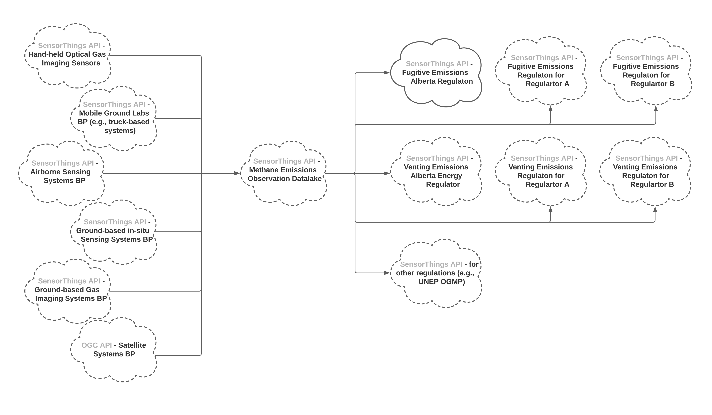

== Fugitive Emissions Management SensorThings API Specification - Part I - AER Directive 60
This chapter describes the entities, their properties and values, and their relations for fugitive emissions reporting requirements based on https://www.aer.ca/regulating-development/rules-and-directives/directives/directive-060[AER Directive 60].

=== Requirement Class: Thing

include::requirements/requirements_class_1.adoc[]

==== Requirement 1
This requirement defines the mandatory properties of a reporting facility (as a Thing).

include::requirements/requirement_1.adoc[]
[#table_req1,reftext='{table-caption} {counter:table-num}']
.Properties of a reporting facility Thing entity
[width="90%",options="header"]
|===
|Name |Definition |Data types and values |Multiplicity and use
|name |the facility ID of the reporting facility |character string type, and the value shall be a valid AER facility ID  |One
|description |a short description of the facility |character string type |One
|properties |the well ID or site ID that is associated with the facility ID  |a JSON object that has a key of "well or site id" and the corresponding value shall be a valid AER well ID or site ID |One
|===

==== Requirement 2
This requirement defines the direct relation between the "Thing" entity and the "Location" and "Datastream" entities.

include::requirements/requirement_2.adoc[]
[#table_req2,reftext='{table-caption} {counter:table-num}']
.Direct relation between a reporting facility Thing entity and other entity types
[width="90%",options="header"]
|===
|Entity type |Relation |Description
|Location |One mandatory |A reporting facility "Thing" SHALL have one Location. Multiple reporting facility "Things" MAY be located at the same "Location".
|Datastream |Three-to-many mandatory |A reporting facility Thing SHALL have three related Datastream entities, describing the number of fugitive emissions, the volume of the fugitive emissions, and the mass of the fugitive emissions respectively. A reporting facility "Thing" MAY have additional "Datastreams".
|===

=== Requirement Class: Location

include::requirements/requirements_class_2.adoc[]

==== Requirement 3
This requirement defines the mandatory properties and relations of the "Location" of the reporting facility.

include::requirements/requirement_3.adoc[]
.Properties of a reporting facility Location entity
[#table_req3,reftext='{table-caption} {counter:table-num}']
[width="90%",options="header"]
|===
|Name |Definition |Data types and values |Multiplicity and use
|name |the reporting facility's legal description of the Legal Subdivision (LSD) according to the https://www.alberta.ca/alberta-township-survey-system.aspx[Alberta Township Survey (ATS)] system |character string type, and the value shall be a valid legal description of the LSD based on the ATS system |One
|description |the description about the Location |character string type |One
|encodingType |the IANA media type for GeoJSON  |character string type, and the value shall be "application/geo+json" |One
|location |the GeoJSON polygon https://datatracker.ietf.org/doc/html/rfc7946#section-3.1.6[[RFC7946]] represents the area of the legal description LSD |a GeoJSON Polygon object, and the value of the GeoJSON Polygon coordinates shall be the boundary of the legal description LSD |One
|===

==== Requirement 4
This requirement defines the direct relation between the "Location" entity and the "Thing" entity.

include::requirements/requirement_4.adoc[]
.Direct relation between a reporting facility Location entity and the Thing entity
[width="90%",options="header"]
|===
|Entity type |Relation |Description
|Thing |Many optional |Multiple reporting facility "Thing" MAY locate at the same "Location". A Location MAY not have a reporting facility "Thing".
|===

=== Requirement Class: Datastream

include::requirements/requirements_class_3.adoc[]

==== Requirement 5
This requirement defines the mandatory properties and relations of the number-of-fugitive-emissions "Datastream" of the reporting facility.

include::requirements/requirement_5.adoc[]
.Properties of a number of fugitive emissions Datastream entity
[width="90%",options="header"]
|===
|Names |Definition |Data types and values |Multiplicity and use
|name |number of identified sources of fugitive emissions |character string type, and the value shall be "Number of identified sources of fugitive emissions" |One
|description |a short description of the Datastream |character string type |One
|observationType |the observation type of the number of fugitive emissions "Observation" is a http://defs.opengis.net/vocprez/object?uri=http://www.opengis.net/def/observationType/OGC-OM/2.0/OM_CountObservation[ISO/OGC 19156] count observation   |the value shall be "http://www.opengis.net/def/observationType/OGC-OM/2.0/OM_CountObservation" |One
|phenomenonTime |this "Datastream" SHOULD have a phenomenonTime, describes the temporal interval of the phenomenon times of all observations belonging to this Datastream |TM_Period (ISO 8601 Time Interval) |One
|===

==== Requirement 6
This requirement defines the direct relation between the "Datastream" entity and other entity types.

include::requirements/requirement_6.adoc[]
.Direct relation between a number of fugitive emissions Datastream entity and other entity types
[width="90%",options="header"]
|===
|Entity type |Relation |Description
|Thing |One mandatory |Each number of fugitive emissions "Datastream" SHALL have one and only one reporting facility "Thing". A reporting facility "Thing" SHALL have one and only one number of fugitive emissions "Datastream".
|Sensor |One mandatory |The "Observations" in a number of fugitive emissions "Datastream" are performed by one "Sensor". One "Sensor" MAY be used by different Datastreams. Note: A "Sensor" in this best practice is a an observation process describing the Fugitive Emissions Management Program (FEMP) that generates the observation result.
|ObservedProperty |One mandatory |The "Observations" of a number of fugitive "Datastream" SHALL observe the methane fugitive emissions "ObservedProperty" as defined in Requirement 11.
|Observation |Many optional |A number-of-fugitive-emissions "Datastream" has zero-to-many "Observations". One Observation SHALL occur in one-and-only-one "Datastream".
|===

==== Requirement 7
This requirement defines the mandatory properties and relations of the number-of-fugitive-emissions "Datastream" of the reporting facility.

include::requirements/requirement_7.adoc[]
.Properties of a fugitive-emissions-volume Datastream entity
[width="90%",options="header"]
|===
|Names |Definition |Data types and values |Multiplicity and use
|name |the volume of fugitive emissions (m3) |character string type, and the value shall be "Fugitive Emissions Volume (m3)" |One
|description |a short description of the Datastream |character string type |One
|observationType |the observation type of the fugitive-emissions-volume "Observation" is a http://defs.opengis.net/vocprez/object?uri=http://www.opengis.net/def/observationType/OGC-OM/2.0/OM_Measurement[ISO/OGC 19156] measurement  |the value shall be ""http://www.opengis.net/def/observationType/OGC-OM/2.0/OM_Measurement"" |One
|phenomenonTime |this "Datastream" SHOULD have a phenomenonTime, describes the temporal interval of the phenomenon times of all observations belonging to this Datastream |TM_Period (ISO 8601 Time Interval) |One
|unitOfMeasurement |the unit of measurement of this Datastream is cubic meter |a SensorThings "unitOfMeasurement" JSON Object, with the following key-value pairs: {"uom":"m3","symbol":"Cubic Meter","definition":"http://qudt.org/vocab/unit/M3"}
|One
|===

==== Requirement 8
This requirement defines the direct relation between the fugitive-emissions-volume "Datastream" entity and other entity types.

include::requirements/requirement_8.adoc[]
.Direct relation between a fugitive-emissions-volume Datastream entity and other entity types
[width="90%",options="header"]
|===
|Entity type |Relation |Description
|Thing |One mandatory |Each fugitive-emissions-volume "Datastream" SHALL have one and only one reporting facility "Thing". A reporting facility "Thing" SHALL have one and only one number of fugitive emissions "Datastream".
|Sensor |One mandatory |The "Observations" in a fugitive-emissions-volume "Datastream" are performed by one "Sensor". One "Sensor" MAY be used by different Datastreams. Note: A "Sensor" in this best practice is a an observation process describing the Fugitive Emissions Management Program (FEMP) that generates the observation result.
|ObservedProperty |One mandatory |The "Observations" of a fugitive-emissions-volume "Datastream" SHALL observe the methane fugitive emissions "ObservedProperty" as defined in Requirement 11.
|Observation |Many optional |A fugitive-emissions-volume "Datastream" has zero-to-many "Observations". One Observation SHALL occur in one-and-only-one "Datastream".
|===

==== Requirement 9
This requirement defines the mandatory properties and relations of the number-of-fugitive-emissions "Datastream" of the reporting facility.

include::requirements/requirement_9.adoc[]
.Properties of a fugitive-emissions-mass Datastream entity
[width="90%",options="header"]
|===
|Names |Definition |Data types and values |Multiplicity and use
|name |the mass of fugitive emissions (m3) |character string type, and the value shall be "Fugitive Emissions Mass Methane (kg)" |One
|description |a short description of the Datastream |character string type |One
|observationType |the observation type of the fugitive-emissions-volume "Observation" is a http://defs.opengis.net/vocprez/object?uri=http://www.opengis.net/def/observationType/OGC-OM/2.0/OM_Measurement[ISO/OGC 19156] measurement  |the value shall be ""http://www.opengis.net/def/observationType/OGC-OM/2.0/OM_Measurement"" |One
|phenomenonTime |this "Datastream" SHOULD have a phenomenonTime, describes the temporal interval of the phenomenon times of all observations belonging to this Datastream |TM_Period (ISO 8601 Time Interval) |One
|unitOfMeasurement |the unit of measurement of this Datastream is cubic meter |a SensorThings "unitOfMeasurement" JSON Object, with the following key-value pairs: {"uom":"kg","symbol":"Kilogram","definition":"http://qudt.org/vocab/unit/KiloGM"}
|One
|===

==== Requirement 10
This requirement defines the direct relation between the fugitive-emissions-volume "Datastream" entity and other entity types.

include::requirements/requirement_10.adoc[]
.Direct relation between a fugitive-emissions-mass Datastream entity and other entity types
[width="90%",options="header"]
|===
|Entity type |Relation |Description
|Thing |One mandatory |Each fugitive-emissions-volume "Datastream" SHALL have one and only one reporting facility "Thing". A reporting facility "Thing" SHALL have one and only one number of fugitive emissions "Datastream".
|Sensor |One mandatory |The "Observations" in a fugitive-emissions-volume "Datastream" are performed by one "Sensor". One "Sensor" MAY be used by different Datastreams. Note: A "Sensor" in this best practice is a an observation process describing the Fugitive Emissions Management Program (FEMP) that generates the observation result.
|ObservedProperty |One mandatory |The "Observations" of a fugitive-emissions-volume "Datastream" SHALL observe the methane fugitive emissions "ObservedProperty" as defined in Requirement 11.
|Observation |Many optional |A fugitive-emissions-volume "Datastream" has zero-to-many "Observations". One Observation SHALL occur in one-and-only-one "Datastream".
|===

=== Requirement Class: ObservedProperty

include::requirements/requirements_class_4.adoc[]

==== Requirement 11
This requirement defines the mandatory properties and relations of the fugitive-emissions "ObservedProperty".

include::requirements/requirement_11.adoc[]
.Properties of a fugitive-emissions ObservedProperty entity
[width="90%",options="header"]
|===
|Names |Definition |Data types and values |Multiplicity and use
|name |the term used in AER Directive 60 to describe fugitive emissions |character string type, and the value shall be "Fugitive Emissions" |One
|description |A description about the ObservedProperty |the value shall be "Fugitive emissions are the unintentional releases of hydrocarbons to the atmosphere.
" |One
|definition |The URI of the ObservedProperty. Dereferencing this URI SHOULD result in a representation of the definition of the ObservedProperty. |the value shall be "https://static.aer.ca/prd/documents/directives/Directive060.pdf#page=72" |One
|===

=== Requirement Class: Observation

include::requirements/requirements_class_5.adoc[]

==== Requirement 12
This requirement defines the mandatory properties and relations of the number-of-fugitive-emissions "Observations".

include::requirements/requirement_12.adoc[]
.Properties of a number-of-fugitive-emissions Observation entity
[width="90%",options="header"]
|===
|Names |Definition |Data types and values |Multiplicity and use
|phenomenonTime |The time period of when the "Observation" happens. |TM_Period |One
|result |the number of fugitive emissions |Integer |One
|parameters |Key-value pairs describing an event-specifc parameter.  |the value SHALL be a JSON object, with a key of "Survey or Screening Type", and the corresponding value SHALL be one of the following: "ALTFEMP", "SITESURVEY", "TANKSURVEY", "WELLSCREENING" |One
|===

=== Requirement Class: FeatureOfInterest

include::requirements/requirements_class_6.adoc[]

==== Requirement 13
This requirement defines the mandatory properties and relations of the "FeatureOfInterest" entity related to the "Observations" of the three mandatory "Datastreams". In the context of the fugitive emissions, the "FeatureOfInterest" of a fugitive emissions "Observation" is where the leaks occur. In AER Directive 60, the "FeatureOfInterest" is modelled as a site. In some cases, a reporting facility "Thing" can have more than one site, such as wells, controlled tanks, process units, or wellhead https://static.aer.ca/prd/documents/manuals/Manual015.pdf#page=17[[AER Manual015 Figure 1]] and https://static.aer.ca/prd/documents/manuals/Manual015.pdf#page=19[[AER Manual015 Figure 3]]. The following figure describes the relationship between a reporting facility "Thing" and "FeaturesOfInterest".

[[fig-thing-featureofinterest-relationship]]
[.text-center, width="90%"]
.Thing and FeatureOfInterest Relationship

An Observation results in a value being assigned to a phenomenon. The phenomenon is a property of a feature, the latter being the FeatureOfInterest of the Observation [OGC and ISO 19156:2011]. In the context of this best practice, the FeatureOfInterest is the site can be the Location of the Thing. For example, the FeatureOfInterest of a wifi-connect thermostat can be the Location of the thermostat (i.e., the living room where the thermostat is located in). In the case of remote sensing, the FeatureOfInterest can be the geographical area or volume that is being sensed.

include::requirements/requirement_13.adoc[]
.Properties of a FeatureOfInterest entity
[width="90%",options="header"]
|===
|Names |Definition |Data types and values |Multiplicity and use
|phenomenonTime |The time period of when the "Observation" happens. |TM_Period |One
|result |the number of fugitive emissions |Integer |One
|parameters |Key-value pairs describing an event-specifc parameter.  |the value SHALL be a JSON object, with a key of "Survey or Screening Type", and the corresponding value SHALL be one of the following: "ALTFEMP", "SITESURVEY", "TANKSURVEY", "WELLSCREENING" |One
|===

=== Requirement Class: Sensor

include::requirements/requirements_class_7.adoc[]

==== Requirement 14
This requirement defines the mandatory properties and relations of the "Sensor" entity. The "Sensor" entity in this best practice is not an instrument, but rather it SHALL be an observation process file:///Users/steveliang/Downloads/10-004r3_Topic_20_Observations_and_Measurements.pdf#page=20[[ISO/OGC 19156:2001 OM_Process]] describing the Fugitive Emissions Management Program (FEMP) that generates the observation result.

include::requirements/requirement_14.adoc[]
.Properties of a Sensor entity
[width="90%",options="header"]
|===
|Names |Definition |Data types and values |Multiplicity and use
|name |a property provides a label for Sensor entity, and it should be a descriptive name of the FEMP that generate the fugitive emissions observation results. |CharacterString |One
|description |the description of the FEMP  |CharacterString |One
|encodingType |the encoding type of the metadata property. |character string type, and the value shall be "application/pdf" or "text/html" |One
|metadata |its value depends on the value of the encodingType. Its value SHALL be a resolvable URI, linking to either a PDF document or an HTML page, describing the FEMP used to generate the fugitive emissions observation results. |the value SHALL be a resolvable URI. |One
|===
